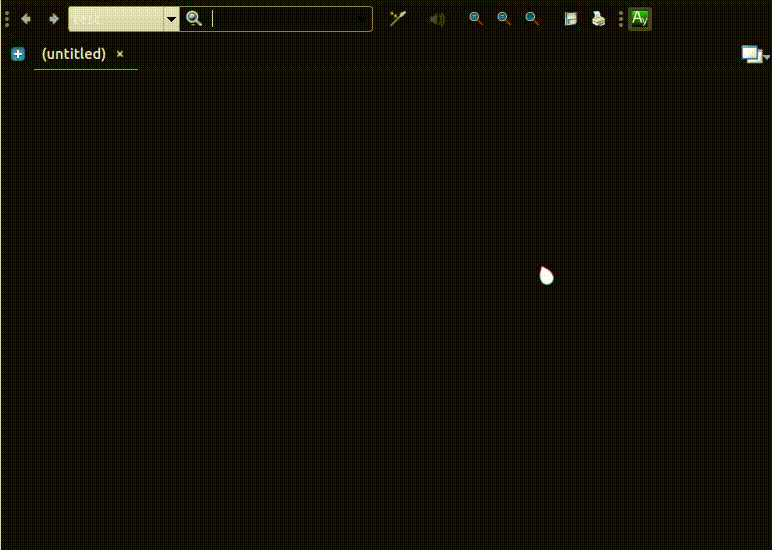

# Ayah Index [Stardict dictionary] English
### compatible with ***Goldendict***, StarDict, ..

A dictionary to search Quran for the corresponding ayah to a notation `(e.g 16:125)` and vice versa 

### Installation
Copy dictionary folder to a location Goldendict is aware of

### Credit
- http://qurandatabase.org (db generated 20/05/2020)

### Notice
- Ayah Index Arabic : [here](https://github.com/mossaybo/ayah-stardict-ar)
- English translation : Yusuf Ali